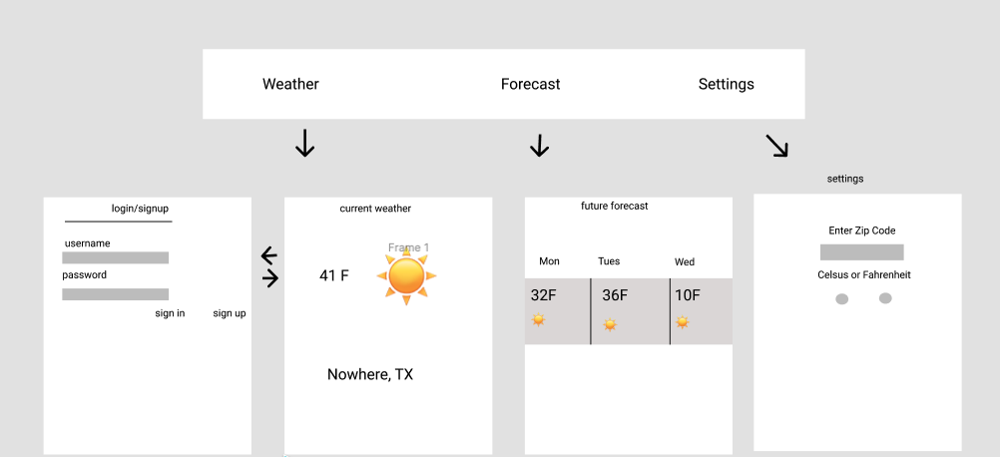

# WeatherBeaver

## Table of Contents
1. [Overview](#Overview)
1. [Product Spec](#Product-Spec)
1. [Wireframes](#Wireframes)
2. [Schema](#Schema)

## Overview
### Description

App that lets users check on the weather in a zip code and see information tailored to them based on their settings. 

### App Evaluation

- **Category:**

Weather

- **Mobile:**

It can use location sensors and push notifications that alert users about important changes or events.

- **Story:**

This is an app with value to everyone who cares about the weather and wants a streamlined experience without any ads.

- **Market:**

The market is targeting every user who just wants the weather without any special frills or ads in the way. Monetization could occur via one-off payments.

- **Habit:**

The average user would open the app at least once a day. Future features could include a social aspect that connects users in different parts of the world with the same weather.

- **Scope:**

The stripped down version of the app is still interesting to build and very doable within a short period of time. At its core, the functionality is clearly defined (show the relevant weather information).

At the same time, there are lots of stretch goals that we can establish.

## Product Spec

### 1. User Stories (Required and Optional)

**Required Must-have Stories**

* ✅ User can enter zip code
* User can choose how to display temperature (celsius vs fahrenheit)
* ✅ Settings are saved locally and remain in place between app restarts
* ✅ User can view the current weather
* User can see upcoming weather
* User can optionally register and login
* Logged in user preferences are saved on server. Prioritized over locally stored preferences

**Sprint 1 Progress**

https://user-images.githubusercontent.com/8713509/159265783-b8cd0f42-376f-48d2-8632-80ccb051bb9e.mp4

**Optional Nice-to-have Stories**

* Uses location sensor for first app run and by user request
* Support for multiple zip codes
* Push notifications on certain events
* Automatic refresh at periodic intervals
* Share weather with friends
* User can view random usernames of others who are interested in the same zip codes
* Find areas with similar weather

### 2. Screen Archetypes

* Current weather Detail 
   * User can view the current weather
* Upcoming weather Detail
   * User can see upcoming weather
* Settings
   * User can enter zip code
   * User can choose how to display temperature (celsius vs fahrenheit)
   * Settings are saved locally and remain in place between app restarts
   * Logged in user preferences are saved on server. Prioritized over locally stored preferences
* Login / registration
   * User can optionally register and login

### 3. Navigation

**Tab Navigation** (Tab to Screen)

* Current weather
* Upcoming weather
* Settings

**Flow Navigation** (Screen to Screen)

* Current weather
   * Settings
   * Upcoming weather
* Login / registration
  * Current weather
* Upcoming weather
   * Current weather
* Settings
   * Current weather

## Wireframes

### [BONUS] Digital Wireframes & Mockups

Done, see above

### [BONUS] Interactive Prototype

## Schema 
[This section will be completed in Unit 9]
### Models

#### Post

   | Property      | Type     | Description |
   | ------------- | -------- | ------------|
   | userID        | String   | unique id for the user post (default field) |
   | zipcode       | Int      | User’s location |
   | tempType      | String   | Temp type (fahrenheit/celsius) |

### Networking

* Current weather
   * (Read/GET) Query current weather for zip code
* Login / registration
  * (Read/GET) Query logged in user object
  * (Create/POST) Create new user info
* Upcoming weather
   * (Read/GET) Query forecast weather for zip code
* Settings
   * (Update/PUT) Update user C vs F preference
   * (Update/PUT) Update user zip code
